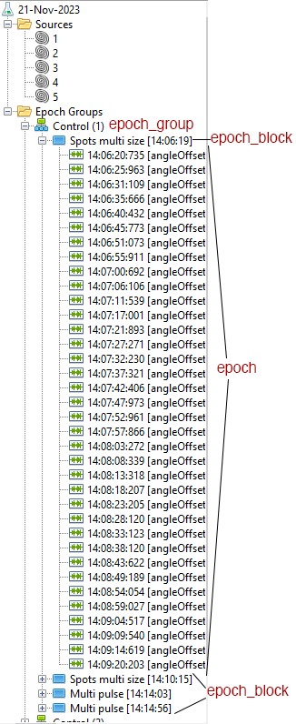

# (very brief) Introductions to Schwartz lab database for physiology

## Symphony ephys experiment struture (short version)
Each experiment day is saved in a `.h5` file. Read more about the Symphony `.h5` file from the [Symphony documentation](https://cafarm.gitbooks.io/symphony/content/File-Format.html).
To give you a quick and dirty look into the file, as well as what to look for in the database, this document describes some of the most essential key points to look at.

The file name is automatically set as `MMDDYYrigName`. For example, `101323A.h5` is the recording data from October 13, 2023, on rig A. 

The `Source` panels shows all data sources for one experiment file.

Each file contains none or one to a few retinas as source. These retinas are described in `experiment_retina`, as well as `experiment_source`. The retinas are strictly linked to animal IDs in the [animal database](), and have an experimenter linked to it.

Each file also contains cell(s). Cells are described under `experiment_source` and `experiment_cell`.Cells can be children of the retina (Cell), or non retinal cell (**Not working as of Nov 26, 2023*).
Retinas can also be parent of Cell Pairs. Contact @zfj1 for more information.

Each source can have one or many experiment epoch group. Epoch groups are initiated by `Begin Epoch Group` and closed by `End Epoch Group` on Symphony.
Epoch groups contain Epoch blocks. In most cases, epoch blocks map to each time you start an experiment protocol (e.g Spot Multi Size). Each epoch block has many epochs (aka. one step in your experiment).

## Important columns in schemas

This section shows columns that are important for understanding and querying electrophysiology data from the MySQL database, using either [DataGrouper](DataGrouper.md), Datajoint queries or SQL queries.

*Side note: Due to cameCase, querying through DataGrouper / Datajoint uses one single underscrore `_`, but if you query though SQL, sometimes there will be two underscores `__` instead*

The descriptions are shown as `column_name` -> `database.table`: details.

General naming conventions:
- Cells are named with date, rig, and cell numbers. For example `101323Ac3` means cell (`c`) number 3, recorded on Rig A, Octorber 13, 2023.

- `file_name` -> [`sln_symphony.Experiment`](./assets/01_sln_symphony_experiment.png): The  `.h5` file name from Symphony. Usually follows the format of `MMDDYYX` with `X` as the rig name (A or B). File names are unique. If a file name query returns null, there is a high chance there is something wrong with the insertion of experiment into the database (see more at [`sln_symphony.insert_experiment('file_name')`]()). This is the utmost important table to join with other tables and/or to restrict other table by, as the majority of tables in `sln_symphony` is connected to `Experiment` (i.e. join / restrict by `file_name = "MMDDYYX"` helps you quickly find your data).
- `experiment_source` -> [`sln_symphony.ExperimentSource`](./assets/02_sln_symphony_%20experiment__source.png): All data sources of an experiments. Can be either a retina, brain area, an animal, or a cell / cell pair. The **combination** of `file_name` and `experimental_source` should be unique. 
- `experiment_retina`: `animal_id`, `side`, `experimenter`, `orientation` -> [`sln_symphony.ExperimentRetina`](./assets/03_sln_symphony_experiment__retina.png): Mapped the retina(s) to animals by `animal_id` (can be joined with tables from `sln_animal`). Also contains `side` (Left / Right), `experimenter` (can be projected out to join with `sln_lab.User`), and `orientation` (ventral up, ventral down, unknown)
- `experiment_cell`: `cell_number`, `online_type`, `x`, `y` -> [`sln_symphony.ExperimentCell`](./assets/04_sln_symphony%20_experiment__cell.png): All online information relating to a cell including: the retina ID, the cell number (aka. the number after `MMDDYYXc*`, for example the 16 in `081223Ac16`, which means the 16th cells, recorded on August 12, 2023, on rig A),  online types and the X/Y coordinates ($\mu m$ from the optic nerve). 
- `experiment_epoch_group`
- `experiment_epoch_block`
- `experiment_epoch_electrode`
- `experiment_epoch`
- `experiment_epoch_channel`
- `dataset`
- `dataset_epoch`