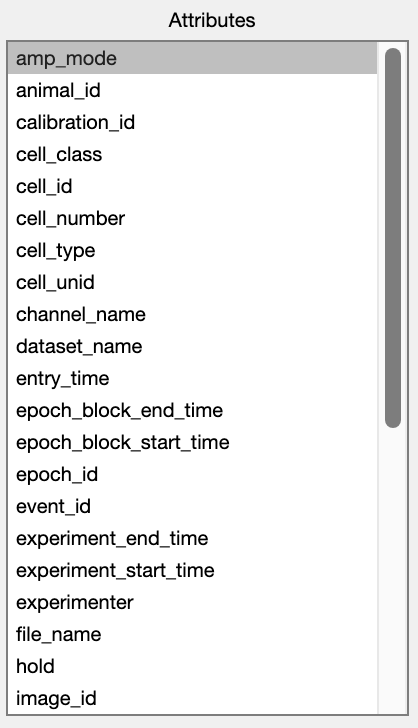
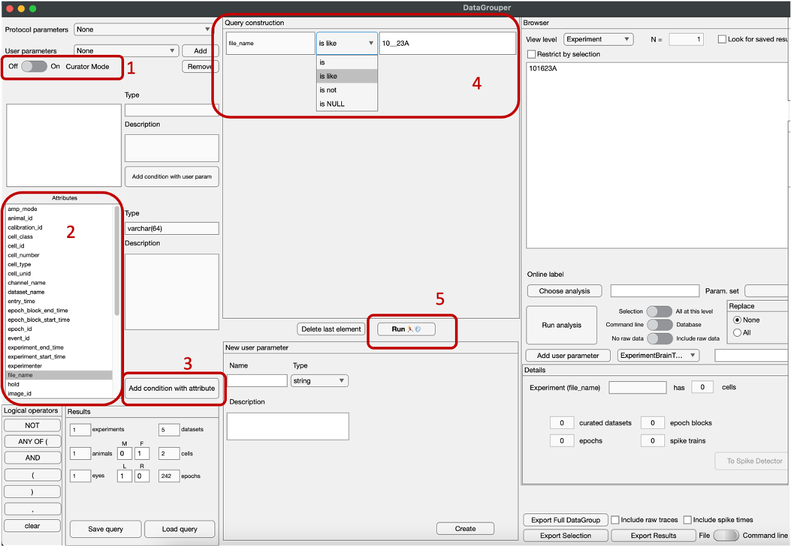
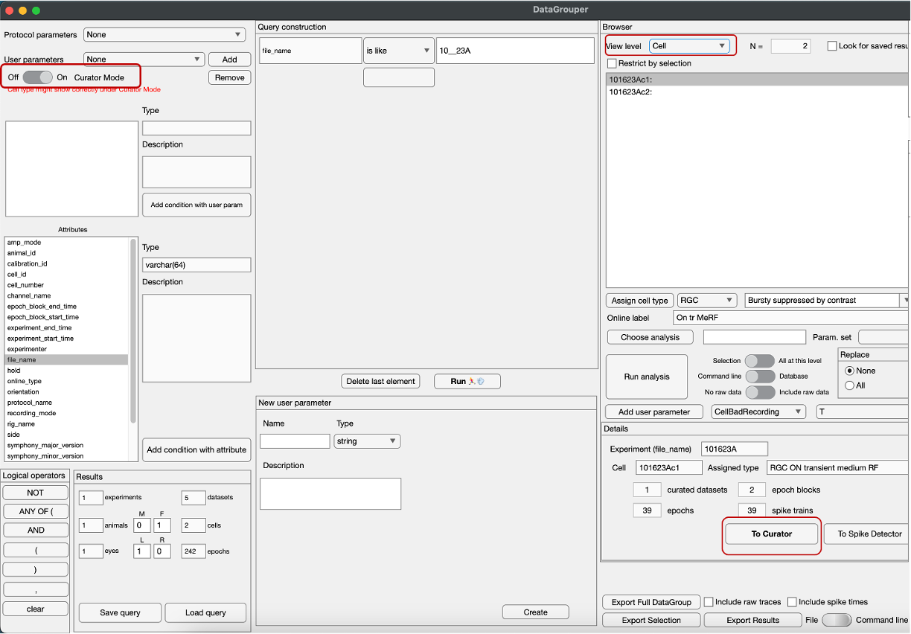

# DataGrouper user manual

## Introduction
DataGrouper was written by @SchwartzNU for experimenters who do not want to suffer the curse of SQL and data query. This GUI features:

⚡️ Fast

🍇 Fruitful

💨 Easy Breezy

🧑‍💻🚫 No coding require

SIKE. It's pretty slow. Be patient. Don't click too fast.

## Requirements
- Setup Datajoint (refer to [onboarding guide]() for MATLAB and Datajoint setup).
- VPN / FSM Ethernet connection.
- FSMResfile mounted.
- [DJ_schwartzlab](https://github.com/SchwartzNU/DJ_schwartzlab/tree/master) is cloned, pulled and on MATLAB PATH. *Side notes: do not Merge Branch if you are not sure what you are doing.*

## Starting DataGrouper
1. Start MATLAB.
2. Type `DataGrouper` in the Command Window. Hit Enter.
3. Wait until the `Attributes` section on the left changes from `Item 1`, `Item 2`, ... to different attributes (figure below), and the window centers on your screen before doing anything else.
   
 

## Looking for your data
### Build a simple query

1. Check if you need [Curator Mode](#curator-mode) or not.
2. Choose the attribute(s) you want to use to look for your data. To understand the attributes, take a look at the [Introduction to the database](00_Introduction_to_the_db.md). The attritubes are column names.
3. Click `Add condition with attribute`.
   If you add more than 2 attributes, the attributes will be automatically "joined" by the logical AND. Logical AND is the basis of all concatenate. Currently in DataGrouper, A OR B should be expressed as some_true_condition `AND ANY OF (`A `,` B`)` with some_true_condition, A, B are the attributes you want to query, `AND ANY OF (` are the combination of `AND` and `ANY OF (` Logical operators, `,` as the operator between attributes A and B, and `)` as the operator after B.
4. Add your attribute properties in querry construction. Remember: do not include quotation marks ('' or "") in your attribute strings.
   To do wildcard, select "IS LIKE" in the drop down menu. Wildcard in attribute properties follows [MySQL wildcard convention](https://www.w3schools.com/mysql/mysql_wildcards.asp), where `%` stands for zero or more characters, and `_` stands for a single character. 
5. Hit `Run`. Sometimes it takes long to finish one query. You should see the result of the query summed up in the `Results` in the bottom left corner. Similarly, you can start changing [`View level`](#view-level) drop down menu to see different levels of the query.

### Look for saved results
1. Check the `Look for saved result` check box.
2. Start building your query.
3. Change View level to the level of analysis result.
4. Select the Dataset / Cell you want to see the results. Results should show up in the `Results in database` on the right. Plotters which are suitable for the correct kind of results will also be automatically available for use.

## Appendix
### Curator mode
In this mode, experiments / cells without Datasets will show up (i.e. everything from the `.h5` file that has been inserted by running `sln_symphony.insert_experiment`). This helps looking for cells / epochs that have not been curated / grouped into datasets. Cells that have not been typed also show up in this mode.

Cell types will not show up in this mode, or show up incorrectly. Please turn off Curator mode before assign cell types.

In Curator mode, the `To Curator` will appear. At `Cell` view level, the `To Curator` and `To Spike Detector` will be enabled. 

You can not query for datasets and analysis results from Curator mode, as well as running Dataset analysis on Curator mode.

### Viewlevel
Experiment -> Animal -> Eye -> Cell -> Dataset -> Epoch.

At Experiment level, the **Details** panels shows the file name, number of cells in the experiment, number of epoch blocks, number of epochs, number of datasets and number of spike trains.
Quick hack: 
   - If number of datasets < number of epoch blocks, that means some epoch blocks have not been curated yet.
   - If number of spike trains < number of epochs, that means some epochs have not been run through SpikeDetector (remember that Spike trains from Cell Attached recordings will not be automatically detected).

At Cell level, beside all the information, the **Details** panels also shows Cell name and Assigned Type.
Quick hack:
   - If Assigned Type shows `unassigned`: the cell has never been opened in Curator.
   - If Assigned Type shows `other unclassified`: the cell has been opened in Curator before.

`Restrict by selection` will help restrict the view level based on what is currently selected. For example, if a cell is selected, the restriction by selection will restrict to only the Experiment containing that cell. Similarly, if an Dataset is selected, only epochs related to that Dataset will be seen when moved to Epoch view level.

